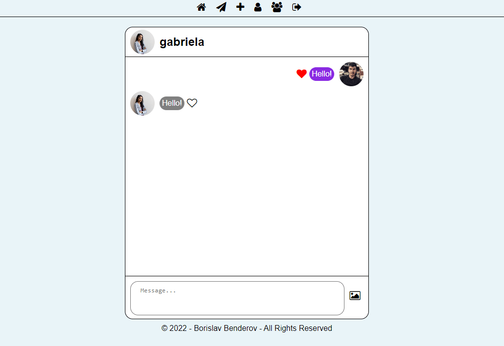
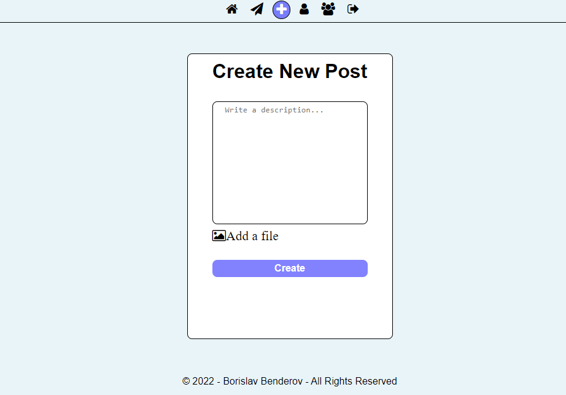
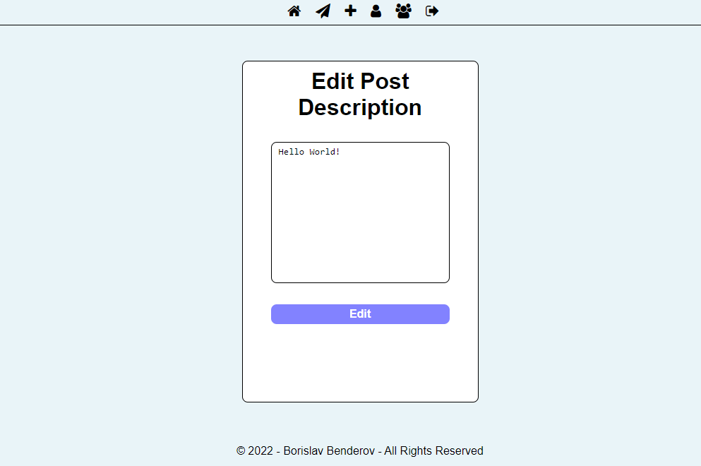
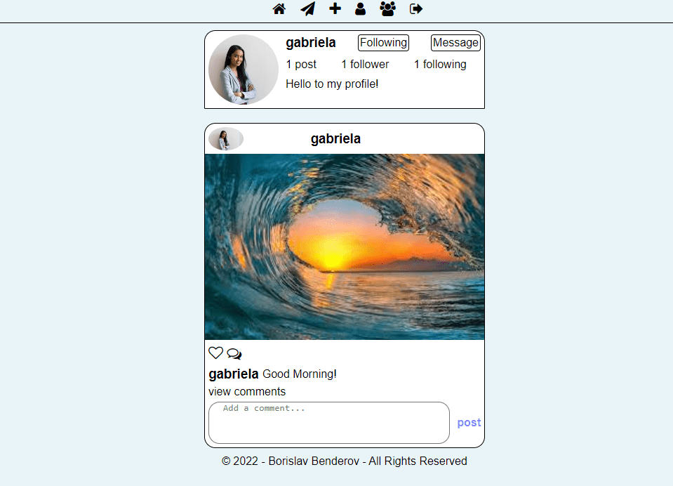

# Social Media Application with React JS

## Project Description

This is social media application created with React JS. Users can interact with each other
with comments on different posts or with messages in chat page. They can create, edit, like 
and delete posts. Users have possibility to make comments on different posts, like comments,
delete their comments and follow or unfollow other users. Users can see who is liked given post
and who are followers and following for a user.

## Services

### Login

This service is initialized with two users, which can be used for immediate testing:
- borko@abv.bg: 123456
- gabi@abv.bg: 123456

### Register

Create a new user by entered email, username, password, confirmation password and profile picture.

### Home

After login or register user will be redirect to a home page. On this page user can see all users posts,
like posts, comment posts and edit or delete his posts.

### Post Details

When user click on view comments on given post in home page he can see all details of this post. On this
page user can like post or comments, make a comments and delete a comments.

### Chat Container

When user click on the second icon in navigation panel he will see all other users. When user click on some
other user he can chat with this user.

### Messages

On this page user can chat with another user. He can send a messages and pictures. Also he can ability to like
other user messages.

### Create Post

When user click on the third icon in navigation panel he will see create new post page. On this page user can
create a post with description and picture.

### User Profile

When user click on the fourth icon in navigation panel he will see his profile information with description (if any),
users posts and number of posts, followers and following.

### Edit Profile

When user click on edit icon in his profile page he can possibility to edit his username, profile description or
profile picture.

### Edit Post Description

When user click on edit icon on some of his posts in home page or profile page, user can possibility to edit
current post description.

### Other Users Profiles

When user click on username of other user in some page he can see profile page for this user with his profile
description (if any), posts and number of posts, followers and following. If user click on follow button he will
follow this user. If he click again user will unfollow current user. If user click on message button he will go
to messages page and start chat with this user.

### Users To Follow

When user click on the fifth icon in navigation panel he will see all registered users who this user dont follow
and he have possibility to follow them when click on the given user follow button.

### Delete Post

When user click on delete icon on some of his posts in home page or profile page, user will be asked to delete
this post. If he confirm post will be deleted.

### Likes

When user click on Liked by people button in given posts he can see who are the users who liked this post.

### Followers

When user click on the followers button on given user profile he can see who are the users who follow this user.

### Following

When user click on the following button on given user profile he can see who are the users who this user follow.

### Logout

When user click on the sixth icon in navigation panel his session has expired.

### Guest Users

Guest users can see only login and register pages. 